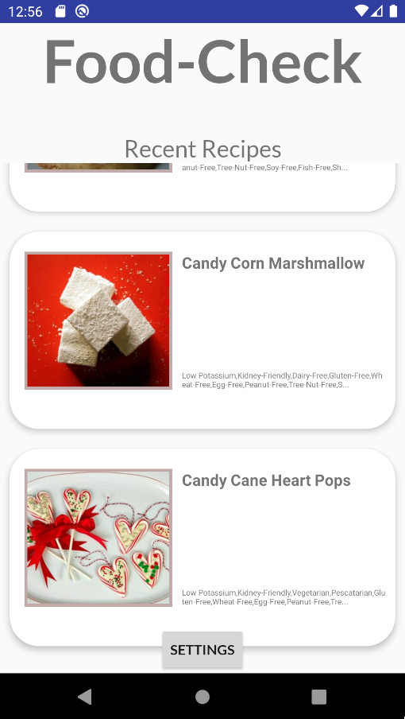
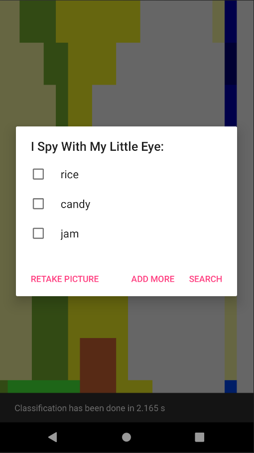
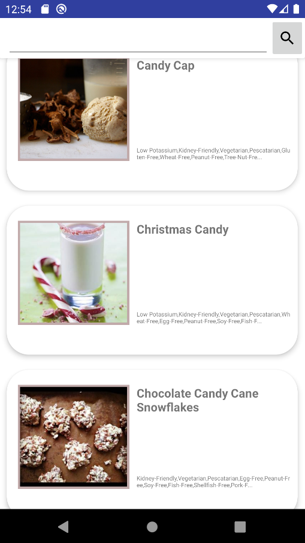

# Food-Check
### Recipe finder Android App with Machine Learning image identification of ingredients based on the InceptionV3 model

### Screenshots
#### Landing Page

#### Classification Page

#### Search Page

### How does it work?

The app follows several interaction paths but the main one is scaning an ingredient adding it to "ingredient list". With that data the application will search the supplied API for recipes matching the ingredients. It was create as a part of university project.

### How to run it?

1. Clone the repository.
2. Run Android Studio from that project.
3. Select Run 'app' in a device with SDK 29

#### Attriburtions: 
[Tensorflow Examples](https://github.com/tensorflow/examples)
